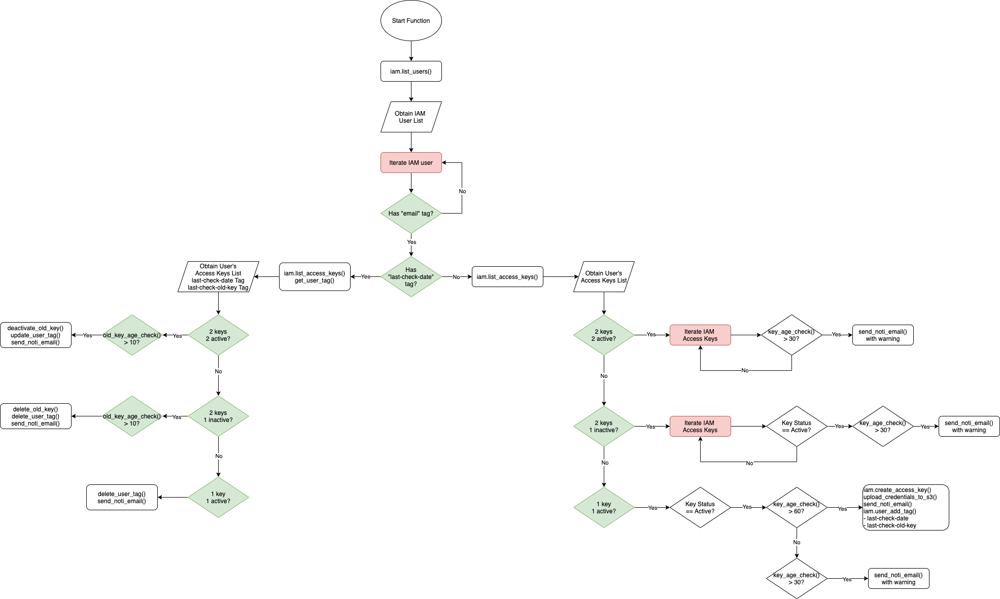

# check-and-rotate-iam-access-keys-age

This function periodically checks all IAM users' access keys that are older than specified `WARNING_DAYS` days and send email notification to users' emails. If the user doesn't change the key in the next specified `OVERDUE_DAYS` days. The function will automatically rotate the keys for them and send the new key privately to their email addresses. 

## Logic Chart



## Requirements 

- Verified SES Email which will be used to send email notification to individual user
- IAM user must have a **Tag Key that contains their email address**
- S3 Bucket that store user access key credentials
- A CloudWatch Event or an EventBridge event with cron (based on your requirement) to run this function periodically. Take note that this function won't store any data to remember which IAM User Access Key it has sent noti email to in the last execution time. So be sure to apply the correct cron expression to run at your desired period. 
- Depends on the number of your IAM users, the Lambda Function Execution Timeout should be extend accordingly. if less than 100 users, 45 seconds is fine. RAM 128MB is enough. 

## Assumptions
- This function will likely create 2 tags for each user during its checking process. So each IAM User should have NO more than 48 created tags present (By default each aws resource can have a maximum of 50 user created tags.)

## Usage

### Create Lambda Function

For simplicity, install serverless CLI tool via this link: https://www.serverless.com/framework/docs/providers/aws/guide/installation/ <- very simple

```sh
$ serverless --version
$ serverless deploy
```

### Environment Variables

You have the following variables to adjust to match the requirements in your system when performing checks and rotations. 

Sample values in `serverless.yml`

```yml
  environment:
    LAMBDA_FUNCTION_NAME: ${self:service}
    SES_EMAIL: "no_reply@email.com" 
    SES_REGION: "ap-southeast-1" 
    IAM_EMAIL_TAG_KEY: "email" 
    S3_CSV_BUCKET: !Ref bucketIamUserCredentials
    LAST_CHECK_DATE_TAG_KEY: "last-check-date"
    LAST_CHECK_OLD_KEY_TAG_KEY: "last-check-old-key"
    WARNING_DAYS: "30"
    OVERDUE_DAYS: "60"
    DEACTIVATE_DAYS: "10"
    DELETION_DAYS: "10"
```

All of these variables are *required*.

`LAMBDA_FUNCTION_NAME`

- Name of the function

`SES_EMAIL`

- Email that is verified in SES console and used to send notifications to users

`SES_REGION`

- Region that SES is configured

`IAM_EMAIL_TAG_KEY`

- Each IAM User must have a tag key with this name and their email address as its value. If an IAM user doesn't have this key, the function won't check and rotate the keys. 

`S3_CSV_BUCKET`

- Name of the Bucket that the function uses to store newly-rotated or newly-created access key and secret of the user. This bucket is created within `serverless.yml` in `resources:Resources` section. You can remove this section and simply specify your own bucket name.

`LAST_CHECK_DATE_TAG_KEY`

- Tag key name the function uses to set the date when the functions perform its checks. This date is important to count the number of days since its creation. 

`LAST_CHECK_OLD_KEY_TAG_KEY`

- Tag key name the function uses to set the key that is being checked. 

`WARNING_DAYS`

- Number of days to send notification to user recommend to change their keys. 

`OVERDUE_DAYS`

- Number of days that the function should automatically perform key roration for users and send notification to them. 

`DEACTIVATE_DAYS`

- After the function rotates the key automatically and informs the user. This variable defines the number of days to keep the *old* key activated. Then the *old* key will be deactivated or disabled. 

`DELETION_DAYS`

- After the *old* key is deactivated by the function. This variable defines number of days to keep it before deletion. 

### User Notice

You can send the information written in `doc/iam_access_keys_guideline.md` to all users. This will proactively inform the users to be aware of this process. 

## Troubleshooting

If you receive Access Denied error, gradually add the required permissions shown up to your IAM User/Role or apply privileged permissions to run.

---
**Note**: This function should be written in Async programming to speed up the checking time. I've written this function long time ago before learning async thus Python was my preference to get started quickly. 
